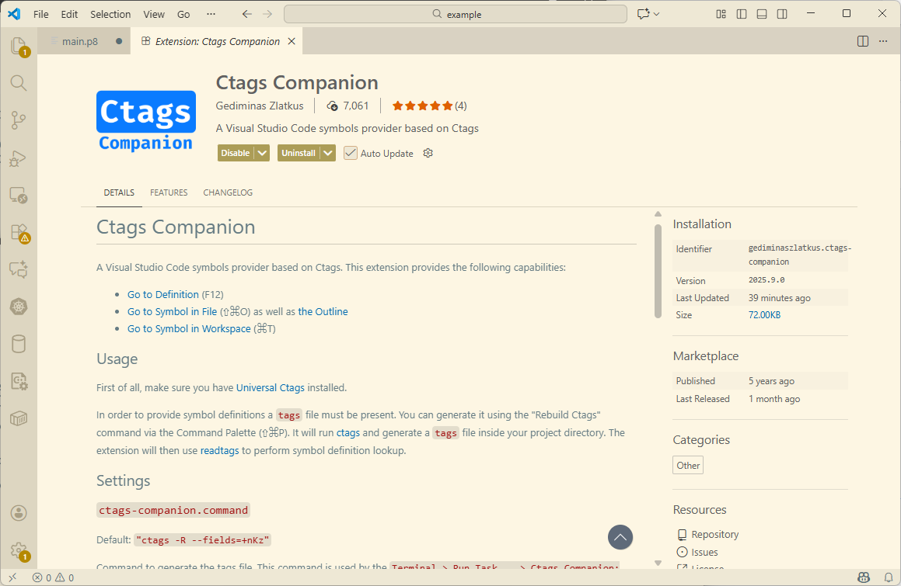
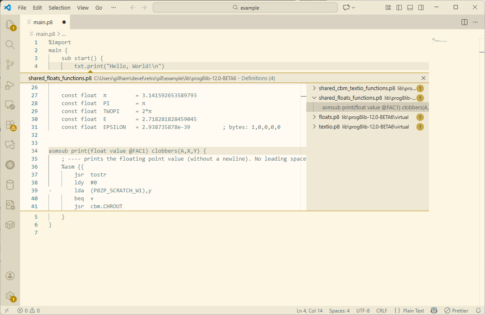
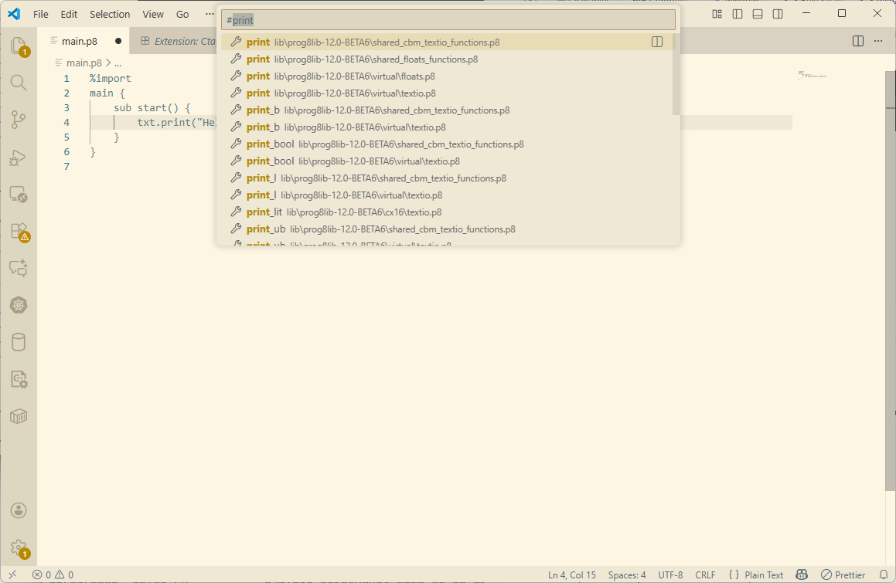

# Prog8 Ctags support

The files in this repository allow you to use [Universal Ctags](https://ctags.io/)  with Prog8. This is particularly useful with the `vim -t tag` command or just vim in general.

The basic purpose of ctags is to index the *definitions* from your source code and let you find them easily.  It is not really to find each use of `print` for example, but to find where `print` is defined.  

## Installation

Clone this repository or download it as a zip file and extract to a working directory.

You should be be able to install Universal Ctags with your operating system's package manager on Linux or [Homebrew](https://brew.sh/) on macOS. For Windows you can download a binary directly.

### Universal Ctags
#### Linux

`apt install universal-ctags`

#### macOS
`brew install universal-ctags`

#### Windows

Download the latest release from the [ctags-win32 project releases](https://github.com/universal-ctags/ctags-win32/releases/tag/v6.1.0) page. Currently that is v6.1.0.

Unzip the downloaded file or just extract `ctags.exe` and `readtag.exe` from it.  Put the files somewhere in your path.  I like to make a directory `%USERPROFILE%\bin` and put it in the path.  You should be able to launch a command prompt and run `ctags --version` if you have successfully added it to your path. Also test `readtags --version` as it is used by some plugins.

If you want to use ctags with Visual Studio Code you can install the Ctags Companion extension.

### Prog8 Universal Ctags configuration files

#### Windows

Installing on Windows is very similar to Linux & macOS below, but the paths are slightly different.
On Windows you also use a `ctags.d` directory (notice the lack of leading `.` dot here)

To create the configuration directory, copy the files, and verify them use the commands below:
```
C:\...\prog8ctags> mkdir %USERPROFILE%\ctags.d
C:\...\prog8ctags> copy dot.ctags.d\* %USERPROFILE%\ctags.d\
C:\...\prog8ctags> dir %USERPROFILE%\ctags.d\
```

Read the Linux & macOS section below an adapt as appropriate for Windows.

#### Linux & macOS
Universal Ctags looks for configuration files in a `.ctags.d` directory in your home directory. You can create this on Linux & macOS with:
```
$ mkdir $HOME/.ctags.d/
```

Then copy the files from the `dot.ctags.d` directory from this repository with:
```
$ cp -pi dot.ctags.d/* $HOME/.ctags.d/
```

You should now have a `default.ctags` and `prog8.ctags` which you can confirm with:
```
$ ls -1 $HOME/.ctags.d/
default.ctags
prog8.ctags
```

Then add the contents of `dot.vimrc` to your normal `.vimrc` file.

One way to do that is to just append it, but be *VERY SURE* you use two `>>` to append to the file not overwrite it.
```
$ cat dot.vimrc >> $HOME/.vimrc
```

A better way would be to just load your `$HOME/.vimrc` with `vim` itself and then read in the `dot.vimrc` file.
```
$ vim $HOME/.vimrc
[and now inside vim]
<shift-g> to go to the end of the file
<o> ("oh") to open a line below the last line
<escape> to get back to command mode
:r dot.vimrc<enter>
:wq
```

Or just paste it in via your terminal copy/paste.

The `dot.vimrc` file contains:
```
" Run ctags
" Auto generate tags file on file write of *.p8 files
autocmd BufWritePost *.p8 silent! !ctags . &
```

What this does is run `ctags . &` in the current directory everytime you write out a file ending in `.p8`.  One *warning* is if you edit files in your home directory and have a large number of directories and files this will look through all of them each time you save it.

You can limit this by editing `$HOME/.ctags.d/default-ctags` and adding the `--maxdepth` parameter.
Here is an example that limits it to two:
```
--maxdepth=2
```

Adjust this as appropriate for your workflow.  I almost always have Prog8 files in a retro development subdirectory so the default works out fine.

## Usage

The simplest use is to launch vim with a particular tag. This will open the first definition of the tag from the `tags` file in the current directory. The `tags` file is generated by the `.vimrc` changes mentioned above.  You can manually run `ctags` or `ctags .` to regenerate the file.

If you want to see what `ctags` generates without writing out the `tags` file, just run it with the `-x` parameter.

Here is an example of running it with a single `.p8` file with a call to `txt.print` and nothing else.

```
$ cat main.p8
%import textio
main {
    sub start() {
        txt.print("Hello, World!\n")
    }
}
$ ctags -x
main             block         2 main.p8          main {
start            sub           3 main.p8          sub start() {
```

Note this example is not super useful as we don't have the information from the standard library module `textio.p8` that was imported. So we only find the main block and the start sub-routine.

Nevertheless we can launch `vim` and have it locate the cursor on the beginning of the line holding the definition of `start` by running this command: `vim -t start`

```
  1 %import textio
  2 main {
  3 █   sub start() {
  4         txt.print("Hello, World!\n")
  5     }
  6 }
```

In this case `vim` starts and the cursor is on line 3.

Within `vim` you can use "Ctrl + ]" to jump to the tag for whatever your cursor is over, if there is one. And you can use `:tn` to go to the next matching tag if there are multiple definitions.  Then "Ctrl + t" jumps back to the previous tags in the stack until you get to where you started.

## Advanced Usage

Starting with v12.0 the Prog8 compiler can be told to dump the embedded library files. The commandline argument/help is `-libdump -> dump all the embedded library files into the specified output directory { String }` for this.

This will improve your ctags tremendously for the builtin library.  Here is how to set it up. (I'm using BETA7 in this example)
```
$ mkdir lib
$ prog8c -libdump lib

Prog8 compiler v12.0-BETA7 by Irmen de Jong (irmen@razorvine.net)
Prerelease version from git commit fb5290e1 in branch master
This software is licensed under the GNU GPL 3.0, see https://www.gnu.org/licenses/gpl.html

Dumping embedded library files into lib
```

Now you have a lib directory with a lot of interesting files.

```
$ ls lib/prog8lib-12.0-BETA7/
bcd.p8                          LICENSE.txt                     shared_cbm_textio_functions.p8
buffers.p8                      math.asm                        shared_compression.p8
c128/                           math.p8                         shared_floats_functions.p8
c64/                            pet32/                          shared_string_functions.p8
compression.p8                  prog8_funcs.asm                 sorting.p8
conv.p8                         prog8_lib.asm                   strings.p8
coroutines.p8                   prog8_lib.p8                    test_stack.p8
cx16/                           prog8_math.p8                   virtual/
cx16logo.p8                     shared_cbm_diskio.p8
```

Now if we run `ctags -x` to see what tags it generates we will see a lot more.  2608 lines of output for my simple hello world example.

```
$ ctags -x | head -5
ABS              extsub       52 lib/prog8lib-12.0-BETA7/cx16/floats.p8 extsub $fe4e = ABS() clobbers(A,X,Y) ; fac1 = ABS(fac1)
ABS              extsub       70 lib/prog8lib-12.0-BETA7/c64/floats.p8 extsub $bc58 = ABS() ; fac1 = ABS(fac1)
ACPTR            extsub       59 lib/prog8lib-12.0-BETA7/cx16/syslib.p8 extsub $FFA5 = ACPTR() -> ubyte @ A ; (alias: IECIN) input byte from serial bus
ACPTR            extsub       74 lib/prog8lib-12.0-BETA7/c128/syslib.p8 extsub $FFA5 = ACPTR() -> ubyte @ A ; (alias: IECIN) input byte from serial bus
ACPTR            extsub       77 lib/prog8lib-12.0-BETA7/c64/syslib.p8 extsub $FFA5 = ACPTR() -> ubyte @ A ; (alias: IECIN) input byte from serial bus
```

You'll notice some duplicate tags.  For example `ABS` is defined in the `cx16/floats.p8` file as well as the `c64/floats.p8` file.  A simple way to clean that up if you're only developing for one platform is to go into the lib directory and remove the targets you aren't using.

If I remove the target directories other than `c64` the lines of output from `ctags -x` is down to 933 and the duplicates from above are gone:
```
$ ctags -x | head -5
ABS              extsub       70 lib/prog8lib-12.0-BETA7/c64/floats.p8 extsub $bc58 = ABS() ; fac1 = ABS(fac1)
ACPTR            extsub       77 lib/prog8lib-12.0-BETA7/c64/syslib.p8 extsub $FFA5 = ACPTR() -> ubyte @ A ; (alias: IECIN) input byte from serial bus
ATN              extsub       80 lib/prog8lib-12.0-BETA7/c64/floats.p8 extsub $e30e = ATN() clobbers(A,X,Y) ; fac1 = ATN(fac1)
AYINT            extsub       32 lib/prog8lib-12.0-BETA7/c64/floats.p8 extsub $b1bf = AYINT() clobbers(A,X,Y) ; fac1-> signed word in 100-101 ($64-$65) MSB FIRST. (might throw ILLEGAL QUANTITY) DON'T USE THIS, USE WRAPPER 'AYINT2' INSTEAD.
AYINT2           asmsub       83 lib/prog8lib-12.0-BETA7/c64/floats.p8 asmsub AYINT2() clobbers(X) -> word @AY {
```

Without the embedded library files running `vim -t print` would give me this error: `E426: Tag not found: print`

Once I run `ctags` (without `-x`) to generate the `tags` file I can again run `vim -t print` and go to this line:
```
 30     sub rvs_off() {
 31         txt.chrout(146)
 32     }
 33
 34
 35 █   asmsub  print (str text @ AY) clobbers(A,Y)  {
"lib/prog8lib-12.0-BETA7/shared_cbm_textio_functions.p8" 292L, 7499B                   35,1           1%
```

So `vim` correctly found the definition of the `print` function in the `shared_cbm_textio_functions.p8` file in the standard library.

The same function can be found from within my source code by pressing Ctrl+] with the cursor on the word `print`:
```
  1 %import textio
  2 main {
  3     sub start() {
  4         txt.print("Hello, World!\n")
  5     }
  6 }
```

Additionally if the cursor is on `txt` you can jump to the definition of the `txt` block in `c64/textio.p8` from the standard library.

# Usage with specific editors

## Visual Studio Code

Install the Ctags Companion extension and open your Prog8 working directory in Visual Studio Code.



Once installed you can run `Ctags Companion: Rebuild Ctags` from the command palette or just `ctags` from terminal or cli.

Once your project directory has a `tags` file you can lookup a symbol by positioning the cursor on it and pressing F12.



You can look at different matching tags in the browser on the right and scroll around in the original source on the left.

Also you can do a symbol lookup with Ctrl-T (on Windows/Linux) and it will do a partial match and give you a list of symbols.

Here I pretty Ctrl-T while on `print` and get the list shown.




# See Also

Here is a really great explanation of how to use VIM with ctags:
[https://kulkarniamit.github.io/whatwhyhow/howto/use-vim-ctags.html](https://kulkarniamit.github.io/whatwhyhow/howto/use-vim-ctags.html)
